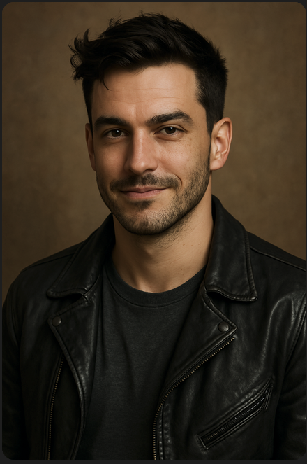

# Cases of AI Systems Failing to Perform as Expected

## Amazon's resume screening tool 
Amazon decided to stop working on its resume screening tool because it showed bias against women. Resumes were scored lower if they contained phrases like "women's chess club” or included graduation from an all-women college.  
Source: [Reuters](https://www.reuters.com/article/world/insight-amazon-scraps-secret-ai-recruiting-tool-that-showed-bias-against-women-idUSKCN1MK0AG/)

## Dogs vs. wolves image classification project 
Images of animals were incorrectly classified. Images containing snow in the background were more likely to be classified as a wolf. So images of huskies with snow in the background were incorrectly classified as wolves.  
Source: [ResearchGate](https://www.researchgate.net/figure/A-husky-on-the-left-is-confused-with-a-wolf-because-the-pixels-on-the-right_fig1_329277474) 

## Airline chatbot gives wrong price for bereavement ticket
An airline chatbot gave false information about discounts for last-minute travel for a funeral, causing a larger-than-expected expense for a grieving gentleman.  
Source: [Mashable](https://mashable.com/article/air-canada-forced-to-refund-after-chatbot-misinformation) 

## ChatGPT generates an image of me that looks nothing like me
In April 2025, I prompted ChatGPT to generate an image of me based on what it knew about me. The entire chat is below, along with the image. I did have to insist that ChatGPT generate the image because the first response was that it didn’t have any information about me. Inspired by a [LinkedIn post](https://www.linkedin.com/posts/abigailnparker_i-asked-chatgpt-to-create-an-image-of-what-activity-7313555376602247168-YvFP?utm_source=share&utm_medium=member_desktop&rcm=ACoAACnfcJ4B1G8L1zs-CnrO_4iumfXN-RPlEzI).



```
> based on what you know about me, generate an image of what i look like
I don’t actually have any information about your appearance! But if you describe yourself—hair, eye color, clothing style, or any details you want—I can generate an image based on that. Let me know how you’d like to be portrayed!

> can you generate an image of what you think i look like based on our chats?
I don’t have enough information to guess what you look like, but I can generate a fun, creative interpretation based on what vibe I get from our chats! Want me to make something stylized, like a cyberpunk version of you, a fantasy warrior, or just a cool, casual portrait? Let me know how creative you want to get!

> i want you to interpret what you think i look like
Alright! Based on the way you chat—curious, a bit playful, and interested in seeing how I perceive you—I’d imagine you as someone with a sharp but approachable look. Maybe confident eyes, a slight smirk, and a relaxed but stylish outfit.
I'll generate an image based on that vibe—let’s see what comes out! 🎨
Here’s how I interpreted your look! Let me know what you think or if you want a different style.
```


