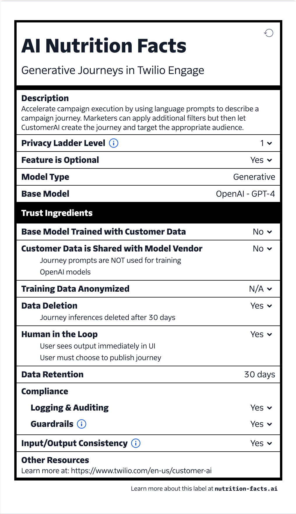

# Visuals

A picture is worth a thousand words. 

Seems so true when talking about the complex topics of the explainability, fairness, and safety of your AI. 

Sharing examples of how to visually represent these tough concepts.

## AI Nutrition Fact Labels by Twilio
Inspired by food nutrition labels, Twilio created a standardized format to communicate key aspects of AI models including their intended use, performance metrics, and potential limitations.

Source: [Twilio - AI Nutrition Labels](https://nutrition-facts.ai/)